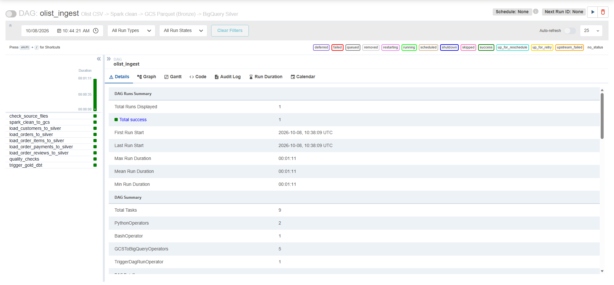
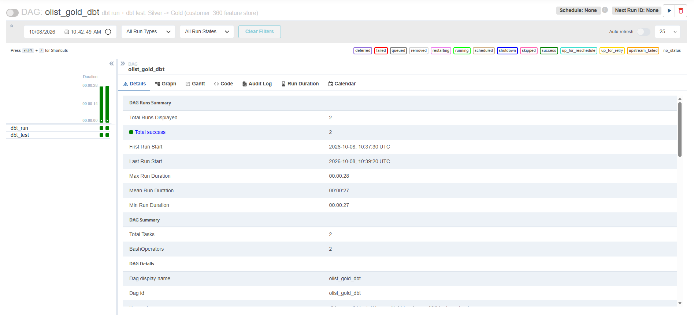
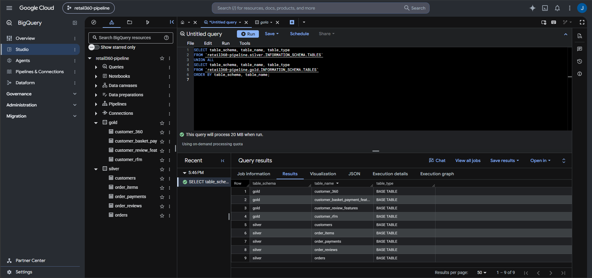
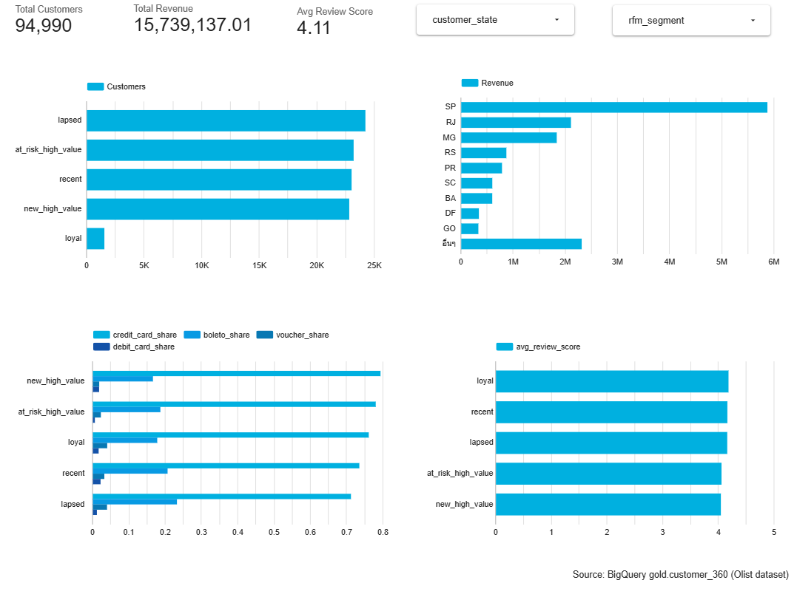

# Retail Customer 360 & Feature Store Hybrid Cloud Pipeline for AI/ML

Production-grade Hybrid Data Platform ออกแบบและพัฒนาเพื่อประมวลผลข้อมูล Olist Brazilian E-Commerce สู่ Analytics Dashboard และ Feature Store สำหรับงาน AI/ML โดยผสาน Local Containerized Compute เข้ากับ Cloud Data Warehouse บน Google Cloud Platform (GCP)

---

## 1. System Architecture & Data Flow

ระบบใช้แนวคิด **Medallion Architecture** ในการจัดการและแบ่งระดับชั้นของข้อมูล:

- **Bronze Layer (Data Lake):** Raw CSV Data ingestion ขึ้นสู่ Google Cloud Storage (GCS)
- **Silver Layer (Data Warehouse):** ทำ Data Cleaning, Deduplication และ Data Normalization ผ่าน Apache Spark และ BigQuery
- **Gold Layer (Feature Store & Customer 360):** Aggregated Table วิเคราะห์ RFM Segmentation, พฤติกรรมการชำระเงิน และ Sentiment สำหรับพร้อมใช้งานบน BI และ AI/ML

## Architecture
+-----------------------------------------------------------------------------------+
|                            LOCAL ENVIRONMENT (Docker)                             |
|  +-----------------------+     +------------------------+     +----------------+  |
|  |    Raw Data (CSV)     | --> |   Apache Airflow DAG   | --> |  Apache Spark  |  |
|  |  (5 Olist Datasets)   |     |     (Orchestrator)     |     |   (PySpark)    |  |
|  +-----------------------+     +------------------------+     +----------------+  |
+--------------------------------------------|--------------------------|-----------+
                                             | Ingest                   | Transform
                                             v                          v
+-----------------------------------------------------------------------------------+
|                        GOOGLE CLOUD PLATFORM (GCP Cloud)                          |
|  +-----------------------+     +------------------------+     +----------------+  |
|  |      Bronze Layer     | --> |      Silver Layer      | --> |   Gold Layer   |  |
|  |    Cloud Storage      |     |  BigQuery (Normalized) |     |  BigQuery ML   |  |
|  +-----------------------+     +------------------------+     +----------------+  |
|                                                                       |           |
|                                                                       v           |
|                                                             +------------------+  |
|                                                             |  Looker Studio   |  |
|                                                             |    Dashboard     |  |
|                                                             +------------------+  |
+-----------------------------------------------------------------------------------+

---

## 2. Tech Stack

Orchestration: Apache Airflow 2.x (Docker Compose, Local Executor, Postgres Backend)

Data Processing: Apache Spark (Standalone Master-Worker) + PySpark, dbt-core (dbt-bigquery)

Cloud Infrastructure: Google Cloud Platform (GCS, BigQuery, Service Account IAM)

Data Visualization: Google Looker Studio

---

## 3. Project Directory Structure
retail-customer-360/
├── credentials/              # GCP Service Account key (*.json) [Git Ignored]
├── dags/                     # Airflow DAG definitions
│   ├── bronze_ingestion_dag.py
│   └── silver_gold_transform_dag.py
├── data/
│   └── raw/                  # 5 Olist CSV files
├── dbt_project/              # Data build tool models & tests
├── docs/
│   └── images/               # Architecture, DAGs, and Dashboard previews
│       ├── dashboard.png
│       ├── airflow_grid_ingestion.png
│       ├── airflow_grid_transformation.png
│       └── bq_gold_tables.png
├── spark_jobs/               # PySpark batch scripts
├── .env.example
├── docker-compose.yml
├── Dockerfile
└── README.md

---

## 4. Pipeline Execution & Lineage
4.1 Airflow PipelinesBronze Ingestion DAG: ดึงไฟล์ CSV จากเครื่อง Local โหลดขึ้น Google Cloud Storage (Bronze Layer)Silver-Gold Transformation DAG: เรียกใช้งาน Spark และ dbt ในการ Transform ข้อมูล Clean ข้อมูล และสร้าง Customer 360 Feature Store บน BigQuery

| Airflow Grid: Ingestion | Airflow Grid: Transformation |
| :---: | :---: |
|  |  |

---

4.2 BigQuery Storage & Gold Tables
Dataset / Target: gold.customer_360

ตาราง Gold รองรับทั้ง Demographic, RFM Segmentation, ช่องทางการชำระเงิน และ Average Review Score

---

## 5. Analytics Dashboard (Looker Studio)
แดชบอร์ดติดตามพฤติกรรมลูกค้าแบบ Customer 360 เชื่อมตรงกับตาราง gold.customer_360 บน BigQuery

Key Metrics Summary:
Total Customers: 94,990 Unique Customers

Total Revenue: R$ 15,739,137.01

Avg Review Score: 4.11 / 5.0

Market Concentration: รัฐ SP (São Paulo) มีรายได้สูงสุดของแพลตฟอร์ม (> 5.8M BRL)

---

## 6. How to Run Locally
    1. Prerequisites & GCP Setup
    สร้าง Service Account บน GCP พร้อมสิทธิ์:

    Storage Object Admin

    BigQuery Admin

    วางคีย์ไฟล์ไว้ที่ credentials/gcp-key.json

    ตั้งค่า GCP Budget Alert สำหรับควบคุมค่าใช้จ่าย

    2. Environment Setup
    สร้างไฟล์ .env จาก .env.example:

    Bash
    cp .env.example .env
    ระบุค่าคอนฟิก:

    ข้อมูลโค้ด
    GCP_PROJECT_ID=your-project-id
    GCS_BUCKET_NAME=your-bucket-name
    GOOGLE_APPLICATION_CREDENTIALS=/opt/airflow/credentials/gcp-key.json
    AIRFLOW_UID=50000

    3. Start Services
    Bash
    docker compose up -d --build
    เข้าใช้งาน Airflow Webserver ได้ที่ http://localhost:8080 (Default: airflow / airflow)

---

